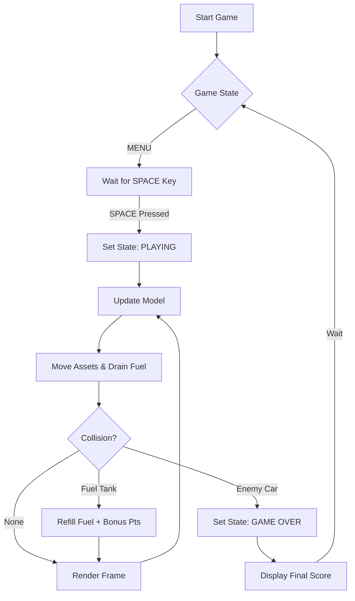

# 🚗 TURBO RACER: FUEL RECOVERY  
### Hackathon + HR Friendly Project Documentation

A high-performance 2D car racing game built using **Python Turtle Graphics** following a clean **MVC (Model–View–Controller)** architecture.  
Designed to demonstrate **game loop design, state management, collision detection, and dynamic difficulty scaling**.

---

## 🎯 Project Objective
To build an interactive arcade-style racing game that demonstrates:
- Real-time game loop processing
- Object-oriented architecture (MVC pattern)
- Dynamic difficulty scaling system
- Resource (fuel) management mechanics
- Collision detection system

---

## 🧠 System Architecture (MVC Pattern)

### 🟦 Model (Game Data & Logic)
Handles:
- Game state (MENU, PLAYING, GAME_OVER)
- Score, level, fuel system
- Enemy & fuel spawn data
- Difficulty scaling logic

### 🟩 View (Rendering Layer)
Handles:
- Turtle-based graphics rendering
- Car, enemies, road, UI elements
- HUD (Score, Level, Fuel Bar)
- Menu & Game Over screens

### 🟥 Controller (Game Engine)
Handles:
- Keyboard input
- Game loop execution
- Collision detection
- Spawn logic (enemies + fuel)
- Game state transitions

---

## 🔁 Game Loop Flow (Core System)


⚙️ Internal Update Cycle (Animation Logic)

```mermaid
Controller->>Model: Update Input (Move Car)
Controller->>Model: Update Game Logic
Model->>Model: Move Enemies & Road
Model->>Model: Check Fuel Drain
Model->>Model: Check Difficulty Level
Controller->>View: Render Frame
View->>Screen: Draw Car, Road, HUD
```
