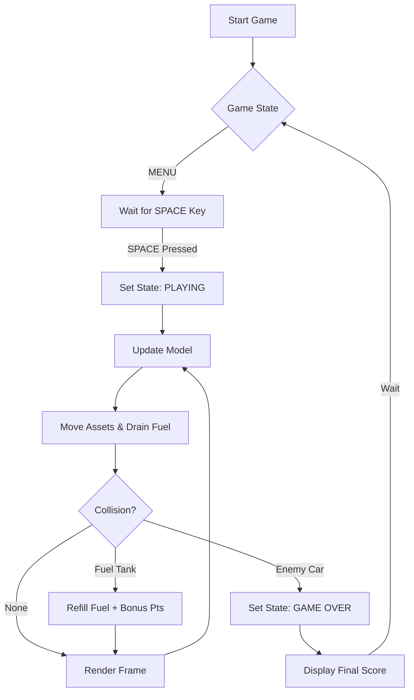
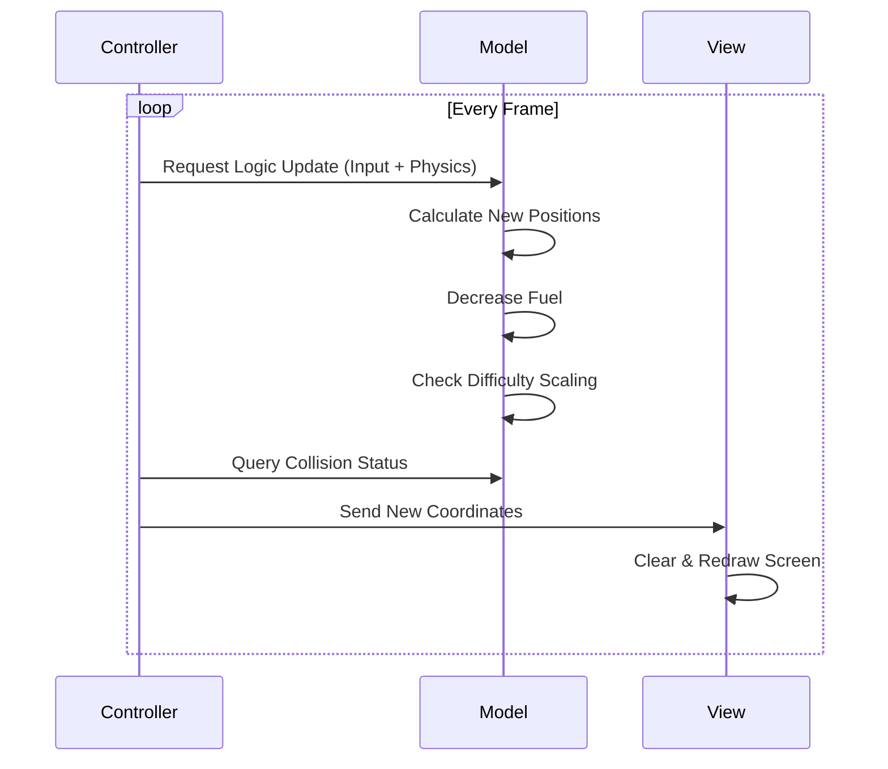

# 🚗 TURBO RACER: FUEL RECOVERY  
### Hackathon + HR Friendly Project Documentation

A high-performance 2D car racing game built using **Python Turtle Graphics** following a clean **MVC (Model–View–Controller)** architecture.  
Designed to demonstrate **game loop design, state management, collision detection, and dynamic difficulty scaling**.

---

## 🎯 Project Objective
To build an interactive arcade-style racing game that demonstrates:
- Real-time game loop processing
- Object-oriented architecture (MVC pattern)
- Dynamic difficulty scaling system
- Resource (fuel) management mechanics
- Collision detection system

---

## 🧠 System Architecture (MVC Pattern)

### 🟦 Model (Game Data & Logic)
Handles:
- Game state (MENU, PLAYING, GAME_OVER)
- Score, level, fuel system
- Enemy & fuel spawn data
- Difficulty scaling logic

### 🟩 View (Rendering Layer)
Handles:
- Turtle-based graphics rendering
- Car, enemies, road, UI elements
- HUD (Score, Level, Fuel Bar)
- Menu & Game Over screens

### 🟥 Controller (Game Engine)
Handles:
- Keyboard input
- Game loop execution
- Collision detection
- Spawn logic (enemies + fuel)
- Game state transitions

---

## 🔁 Game Loop Flow (Core System)

⚙️ Internal Update Cycle (Animation Logic)

## 🚀 Key Technical Features

### 🎯 Collision Box Logic (Hitbox Detection)
The game uses a **custom coordinate-based collision system** instead of complex physics engines.  
Each object (car, enemies, fuel) is treated as a bounding area, and collisions are detected using distance calculation:

::contentReference[oaicite:0]{index=0}

If the calculated distance is below a defined threshold, a collision event is triggered (enemy crash or fuel collection).

---

### ⚡ Frame-Independent Game Logic (Delta-Based Thinking)
The game is designed to remain smooth across different hardware performances.

Instead of relying on fixed movement speed alone, all updates are handled in a consistent loop interval (~60 FPS), ensuring:
- Smooth car movement
- Stable enemy motion
- Consistent gameplay speed across devices

This makes the experience **hardware-independent and responsive**.

---

### 🎲 Procedural Spawning System
Enemies and fuel items are generated using a **weighted randomness algorithm**:

- Ensures no unfair clustering of obstacles
- Maintains at least one safe lane possibility
- Balances difficulty dynamically based on score level
- Prevents “impossible scenarios” during gameplay

This creates a **fair but unpredictable arcade experience**.

---
