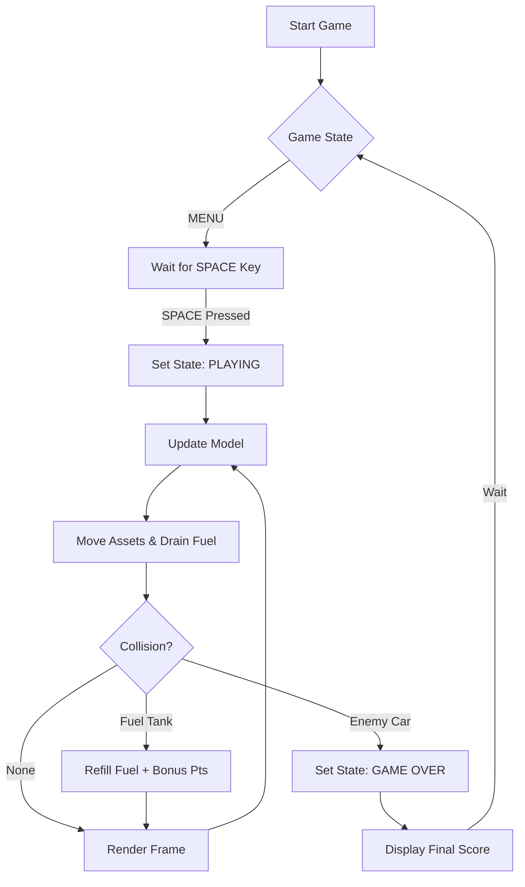
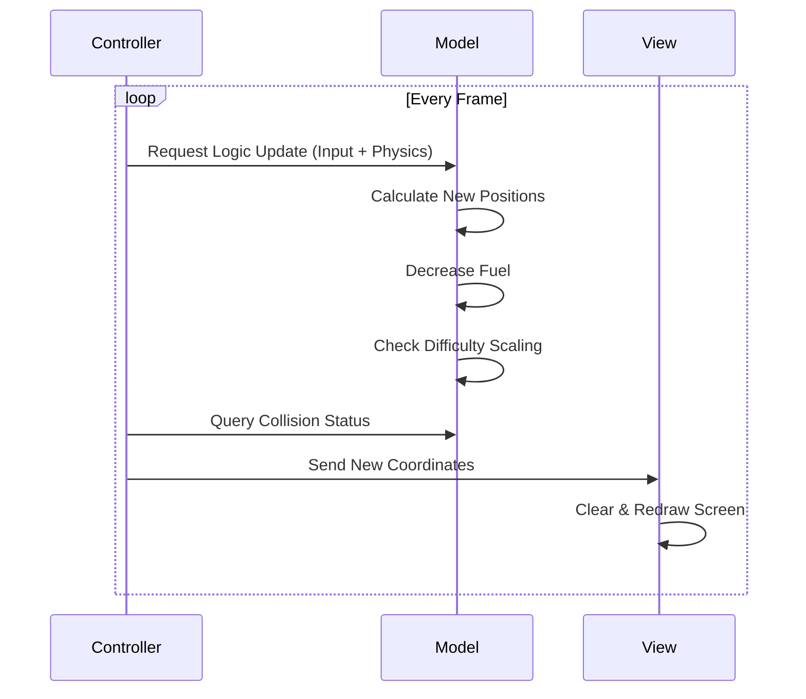

# 🏎️ TURBO RACER: FUEL RECOVERY  
> *High-Performance Arcade Logic meets MVC Architecture.*

<p align="center">
  
</p>
  
</p>

<p align="center">
  <strong>Simulation → Logic → Optimization</strong><br/>
  A cognitive racing engine built with Python & Turtle Graphics.
</p>

<p align="center">
  
  
  
</p>

---

## 🎯 Project Objective
To build an interactive arcade-style racing game that demonstrates:
- Real-time game loop processing
- Object-oriented architecture (MVC pattern)
- Dynamic difficulty scaling system
- Resource (fuel) management mechanics
- Collision detection system

---

## 🧠 System Architecture (MVC Pattern)

### 🟦 Model (Game Data & Logic)
Handles:
- Game state (MENU, PLAYING, GAME_OVER)
- Score, level, fuel system
- Enemy & fuel spawn data
- Difficulty scaling logic

### 🟩 View (Rendering Layer)
Handles:
- Turtle-based graphics rendering
- Car, enemies, road, UI elements
- HUD (Score, Level, Fuel Bar)
- Menu & Game Over screens

### 🟥 Controller (Game Engine)
Handles:
- Keyboard input
- Game loop execution
- Collision detection
- Spawn logic (enemies + fuel)
- Game state transitions

---

## 🔁 Game Loop Flow (Core System)


⚙️ Internal Update Cycle (Animation Logic)



### 🎯 Collision Detection

Collision Box Logic: Custom-built hitbox detection using coordinate geometry:

$$
d = \sqrt{(x_2 - x_1)^2 + (y_2 - y_1)^2}
$$

Delta-Time Logic: Ensures the game remains playable on different CPU speeds.

Procedural Spawning: Enemies and fuel items are generated using weighted randomness to prevent "impossible" lanes.


## ▶️ How to Run the Project

### 1️⃣ Clone the Repository
```bash
git clone https://github.com/Zishan-125/Car_Game-Compiler_Design-.git
```
2️⃣ Move into Project Directory
```bash
cd Car_Game-Compiler_Design-
```
3️⃣ Run the Game
```bash
python car_game.py
```
⚙️ Requirements
```bash
Python 3.x
```
No external libraries required (only built-in Python modules).

🏗️ Architecture (MVC)
```bash
Model: Game data (score, fuel, enemies, level)
View: Turtle rendering system (UI, graphics)
Controller: Input handling + game loop logic
```

👨‍💻 Author Details
```bash
Name: Abdullah Al Mamun Zishan
Role: CSE Student & Developer
University: Feni University
```
🌐 Links
```bash
GitHub: https://github.com/Zishan-125
LinkedIn: www.linkedin.com/in/abdullah-al-mamun-zishan-606550282
```
🚀 Project Goal
```bash
To demonstrate real-time game engine concepts using Python with:

State management
Collision systems
Procedural generation
Clean software architecture (MVC)
```
